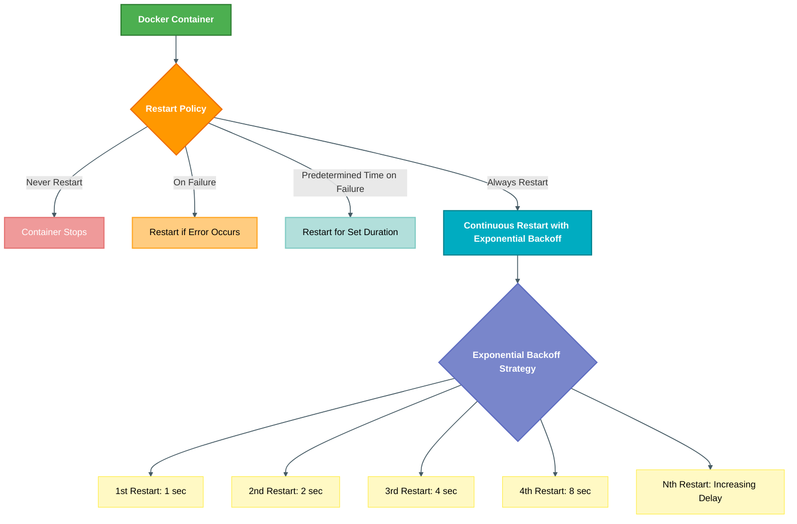

# 🚀 Mastering Docker Resilience: Auto-Restart & Exponential Backoff Explained

[](https://github.com/TheToriqul/docker-auto-restart)
[](https://github.com/TheToriqul/docker-auto-restart/stargazers)


## 📋 Overview

This project explores Docker’s automatic restart policies to ensure container resilience and uptime, even in cases of failure. Through this journey, I gained practical insights into Docker's restart management capabilities and the exponential backoff strategy for controlling restart timing. The primary goal was to gain hands-on experience with container reliability and failover techniques, which are essential for production environments.

## 🏗 Technical Architecture

Docker provides an array of restart policies to automatically manage container restarts:
- **Never Restart (default):** Containers will not restart on failure.
- **Restart on Failure:** Containers restart only when a failure is detected.
- **Restart for a Predetermined Time on Failure:** Containers restart for a set period after each failure.
- **Always Restart:** Containers restart regardless of the reason for stopping, illustrating the exponential backoff strategy.



Docker’s **exponential backoff strategy** progressively increases the delay between restart attempts to avoid constant restart loops. This helps prevent system strain by extending the wait time for each successive restart attempt.

## 💻 Technical Stack

- **Containerization**: Docker
- **OS**: Ubuntu (reference container for testing)

## ⭐ Key Features

1. **Automatic Restart Policies**  
   Different policies for managing container restarts based on the reason for stopping.

2. **Exponential Backoff Strategy**  
   A progressive backoff period for each restart attempt (1s, 2s, 4s, etc.), preventing continuous restart loops and reducing potential system impact.

3. **Live Monitoring and Logging**  
   Commands to monitor container state and review logs to understand restart behavior and timing.

4. **Limitations and Advanced Control**  
   Observations on limitations during backoff periods, including restrictions on running commands in a container while it's restarting.

5. **Advanced Strategies for Production**  
   Suggestions for using init or supervisor processes to improve control over container restart behavior in production environments.

## 📚 Learning Journey

### Technical Mastery

1. Understanding Docker’s automatic restart policies and configuring them with the `--restart` flag.
2. Observing Docker’s exponential backoff timing for container restart attempts.
3. Gaining practical knowledge of the container lifecycle and state monitoring.
4. Learning advanced container management options for greater control over container behavior.
5. Using Docker logs and exec commands for real-time troubleshooting and inspection.

### Professional Development

1. Problem-solving techniques for handling container failures and ensuring uptime.
2. Documentation of container restart policies and backoff behaviors.
3. Applying critical thinking to choose appropriate restart policies for various scenarios.
4. Developing familiarity with container resilience techniques in production environments.
5. Improving adaptability in configuring Docker containers for reliability and robustness.

## 🔄 Future Enhancements

<details>
<summary>View Planned Improvements</summary>

1. Implementing init and supervisor processes for better lifecycle management.
2. Adding container health checks to improve reliability.
3. Testing container restart strategies across different environments.
4. Exploring integration with logging and monitoring tools for deeper insights.
5. Expanding configurations to manage containers under complex load conditions.
6. Implementing automated testing for failure and restart conditions.

</details>

## ⚙️ Installation

<details>
<summary>View Installation Details</summary>

### Prerequisites

- **Docker**: Ensure Docker is installed on your system.
- **Busybox**: Used for simple container operations.

### Setup Steps

1. Clone the repository:
    ```bash
    git clone https://github.com/TheToriqul/docker-auto-restart.git
    ```
2. Navigate to the project directory:
    ```bash
    cd docker-auto-restart
    ```
3. Review and run Docker commands as outlined in the `scripts.sh` file.

</details>

## 📖 Usage Guide

<details>
<summary>View Usage Details</summary>

### Basic Usage

Run the following command to start a container with the `always` restart policy:

```bash
docker run -d --name backoff-detector --restart always busybox date
```

### Monitoring Restarts

Use this command to follow the container logs and observe the exponential backoff restart timings:

```bash
docker logs -f backoff-detector
```

### Limitations

During backoff periods, the container is in a "restarting" state, which prevents execution of `docker exec` commands. Attempting to do so will result in an error:

```bash
docker exec backoff-detector echo "Test"
```

</details>


## 📫 Contact

- 📧 Email: toriqul.int@gmail.com
- 📱 Phone: +65 8936 7705, +8801765 939006

## 🔗 Project Links

- [GitHub Repository](https://github.com/TheToriqul/docker-auto-restart)
- [Documentation](https://github.com/TheToriqul/docker-auto-restart/docs)

---

Feel free to explore, modify, and build upon this project as part of my learning journey. I hope it serves as a valuable resource for understanding Docker's automatic restart capabilities and exponential backoff strategy!